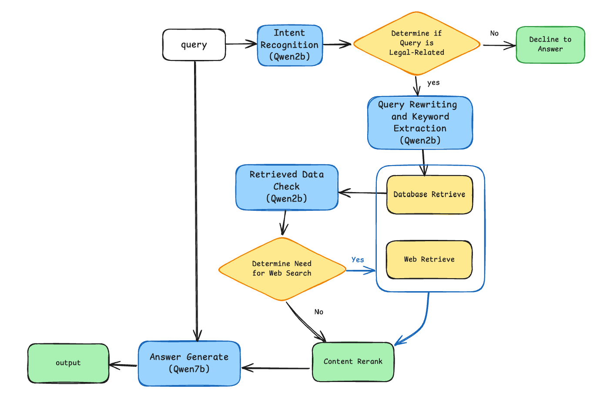

# RAG basd legal AI assistant
This is a RAG project dedicated to answering legal questions(Chinese). The database is constructed based on Chinese law. The large language model used is the [Qwen](https://github.com/QwenLM/Qwen) series ([3rd party API](https://novita.ai/model-api/pricing)). The database is [ElasticSearch](https://github.com/elastic/elasticsearch), deployed by docker. Vectorization model is [bge-large-zh](https://github.com/FlagOpen/FlagEmbedding/tree/master). search API is [DuckDuckGo](https://github.com/deedy5/duckduckgo_search).

## Workflow


## Installation
### 1. Clone the repository
```bash
git clone git@github.com:Jaron-U/legal_AI_assistant.git
cd legal_AI_assistant
```
### 2. Install the dependencies
```bash
pip install -r requirements.txt
```

## Build the database
### 1. Download the data
1. https://github.com/billvsme/law_ai/tree/master/Law-Book
2. https://drive.google.com/file/d/1h_Ce8S7bqr5D0ozmYSAAK8G2ivun9cvn/view
3. https://drive.google.com/file/d/1_3Yw3Pt5vhtMMj6UOVHiCXFlNEe5LQPT/view

### 2. Save the data to json
```bash
cd data_process
python save_json.py # need to modeify the path in the script
```

### 3. Build the database
```bash
# download the docker if you don't have

# step1
docker network create es-net

# step2
docker pull elasticsearch:7.17.18

# step3
docker run -d \
        --name es \
        -e "ES_JAVA_OPTS=-Xms2g -Xmx2g" \
        -e "discovery.type=single-node" \
        -v  "es-data:/usr/share/elasticsearch/data" \
        -v "es-data:/usr/share/elasticsearch/plugins" \
        --privileged \
        --network es-net \
        -p 9200:9200 \
        -p 9300:9300 \
        elasticsearch:7.17.18

# step4, install the ik plugin
docker exec -it es bash

cd /usr/share/elasticsearch/bim
./elasticsearch-plugin install https://release.infinilabs.com/analysis-ik/stable/elasticsearch-analysis-ik-7.17.18.zip

exit
docker restart es
```

### 4. Configure your API
```bash
mkdir .env
```
add "OPENAI_API_KEY=your_api_key" to the .env file

Also your can modify your own LLM API url in the config.py. The large model API you use needs to be compatible with the OpenAI interface

### 6. Start the project
```bash
python main.py
```

## Evaluate the model
[Law Bench](https://github.com/open-compass/LawBench/tree/main)  
I am not testing yet ... 

